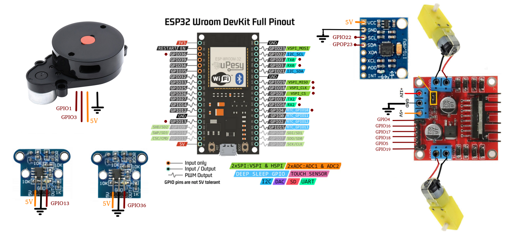

# Wheel drive robot with LiDAR

Developed a robot system as part of an engineering thesis project, consisting of two ESP-based modules and a Python Flask server. One ESP controlled motors and collected data from a gyroscope and encoders; the other handled LiDAR data acquisition and communication with the server. The server enabled robot control, visualization, and room mapping based on LiDAR measurements.

## Connections

